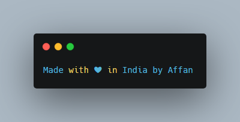

# Carbon API {Unofficial}
Create and share beautiful images of your source code!
---
<p align="center">
    <a href="https://github.com/carbon-app/carbon">
        
    </a>
    <br>
    <b>Unofficial API</b>
    <br>
</p>

### Show some :heart: and :star: the repo

[](https://github.com/AffanTheBest/APIs)

[](https://t.me/asprojects)

## Unofficial Carbon API written in Node Js using Puppeteer
[](https://nodejs.org/en/) [](https://github.com/ellerbrock/open-source-badges/)

> **Carbon**  makes it easy to create and share beautiful images of your source code

#### Usage
You can use the API by sending a GET or a POST request using these params

| parameter              | default                    | type    | description                                      |
| ---------------------- | -------------------------- | ------- | ------------------------------------------------ |
| `text` (required)      |                            | string  | Code snippet                                     |
| `bg`                   | `"rgba(171, 184, 195, 1)"` | string  | Hex or rgba color                                |
| `ds`                   | `true`                     | boolean | Turn on/off shadow                               |
| `blur`                 | `"68px"`                   | string  | shadow blur radius                               |
| `dsyoff`               | `"20px"`                   | string  | shadow offset y                                  |
| `es`                   | `"2x"`                     | string  | resolution of exported image, e.g. `1x`, `3x`    |
| `fs`                   | `"14px"`                   | string  | font size                                        |
| `fm`                   | `"Hack"`                   | string  | font family, e.g. `JetBrains Mono`, `Fira Code`. |
| `fl`                   | `1`                        | number  | first line number                                |
| `l`                    | `"auto"`                   | string  | programing language for properly highlighting    |
| `ln`                   | `false`                    | boolean | turn on/off line number                          |
| `ph`                   | `"56px"`                   | string  | horizontal padding                               |
| `pv`                   | `"56px"`                   | string  | vertical padding                                 |
| `t`                    | `"seti"`                   | string  | code theme                                       |
| `wm`                   | `false`                    | boolean | turn on/off watermark                            |
| `wa`                   | `true`                     | boolean | turn on/off width adjustment                     |
| `wc`                   | `true`                     | boolean | turn on/off window controls                      |
| `wt`                   | `"none"`                   | string  | window theme                                     |

### GET `/`
Params are encoded in url
```bash
https://carbon.vercel.app/?text=Made+with+❤+in+India+by+Affan
```

### RESPONSE
**Response** is an image of a code or text snippet.
<p align="center">
    <a href="https://github.com/AffanTheBest">
        
    </a>
</p>

#### Deploy Option

* **[Heroku](https://www.heroku.com/) Method** 
  [](https://heroku.com/deploy?template=https://github.com/AffanTheBest/Carbon-API/tree/master)

* **Other Method** 

  ```bash
  # Clone the repo
  git clone https://github.com/AffanTheBest/Carbon-API
  cd Carbon-API

  # install npm modules
  npm install

  # Finally run the app
  npm start
  ```
### Made with ❤️️ in India
### Copyright & License 

* Copyright (C) 2020 by [Affan](https://github.com/AffanTheBest)
* Licensed under the terms of the [GNU GPL Version 3](https://github.com/AffanTheBest/Carbon-API/blob/main/LICENSE)
